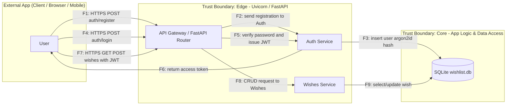

# Data Flow Diagram (DFD) — Wishlist App

## Main scenario

```mermaid
flowchart LR
    subgraph External["External App (Client / Browser / Mobile)"]
        U[User]
    end

    subgraph Edge["Trust Boundary: Edge - Uvicorn / FastAPI"]
        GW[API Gateway / FastAPI Router]
        AUTH[Auth Service]
        WISH[Wishes Service]
    end

    subgraph Core["Trust Boundary: Core - App Logic & Data Access"]
        DB[(SQLite wishlist.db)]
    end

    %% Data flows
    U -->|F1: HTTPS POST auth/register| GW
    GW -->|F2: send registration to Auth| AUTH
    AUTH -->|F3: insert user argon2id hash| DB

    U -->|F4: HTTPS POST auth/login| GW
    GW -->|F5: verify password and issue JWT| AUTH
    AUTH -->|F6: return access token| U

    U -->|F7: HTTPS GET POST wishes with JWT| GW
    GW -->|F8: CRUD request to Wishes| WISH
    WISH -->|F9: select/update wish| DB
```
